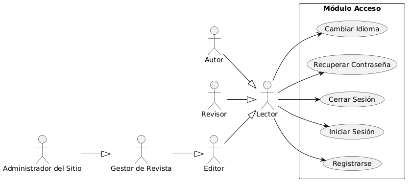
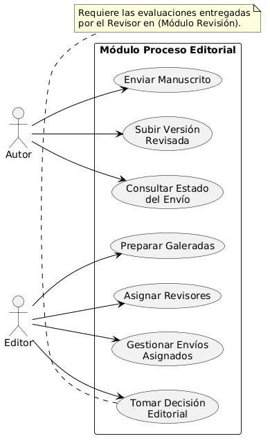
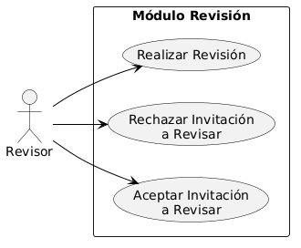
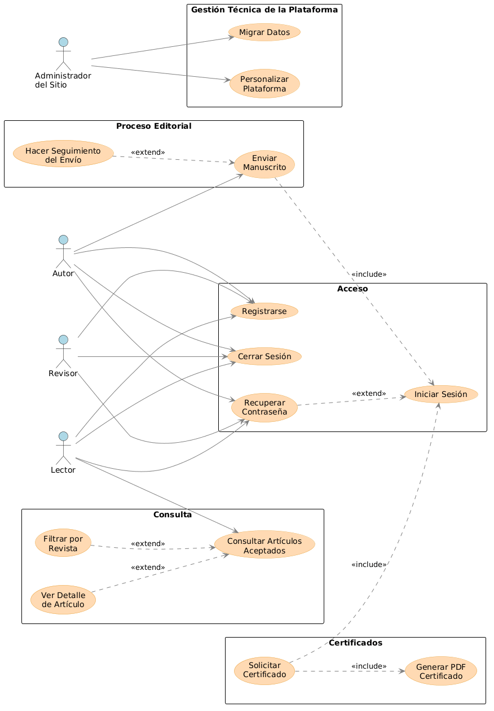
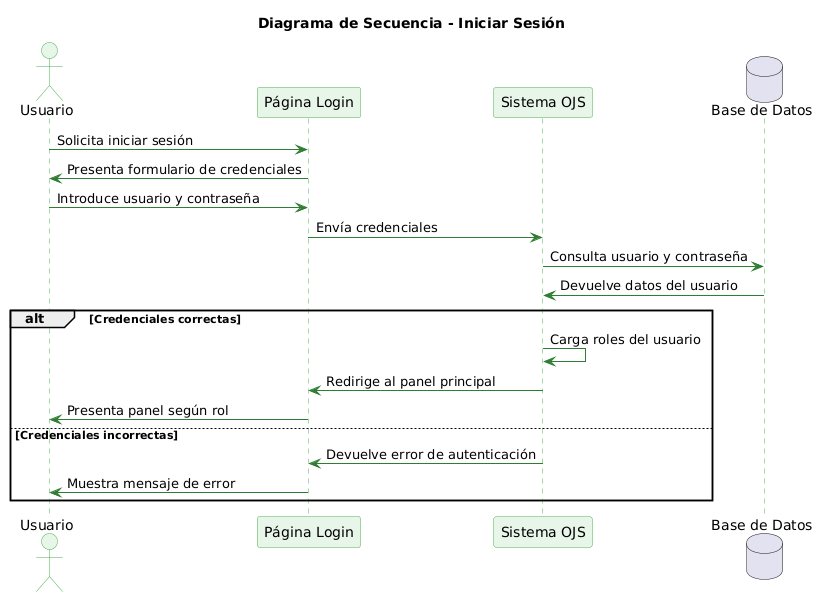
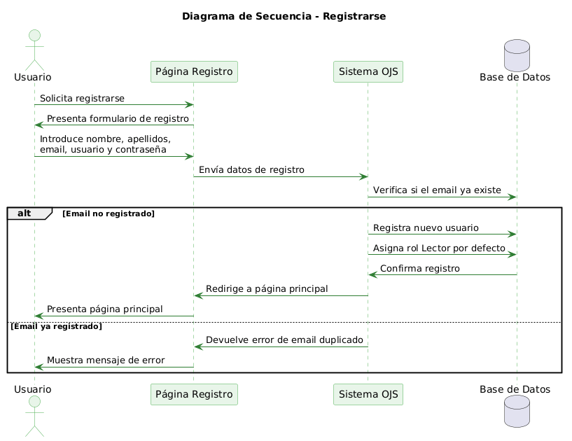
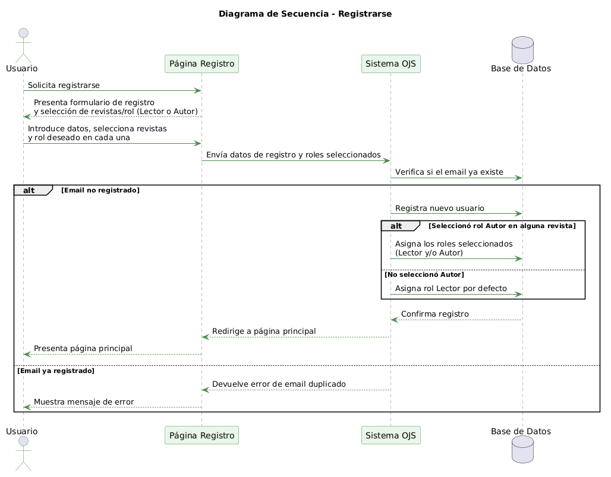
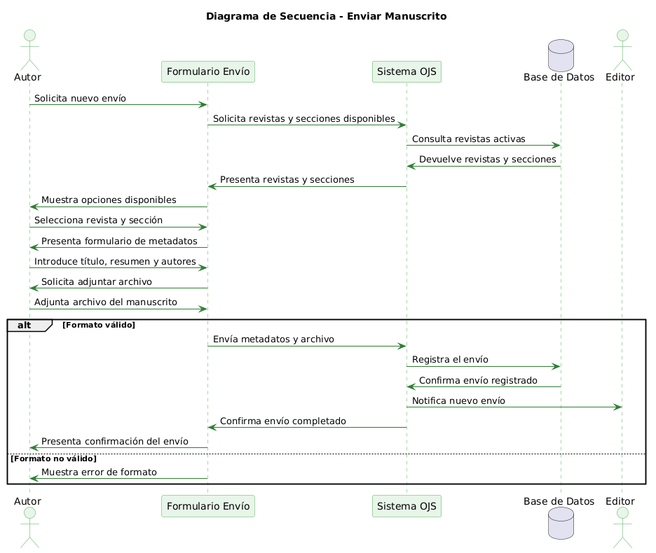

# Migración y Personalización de Open Journal Systems (OJS) — TFG

Migración de una plataforma editorial de OJS 3.1 a OJS 3.4.0.1, con personalización mediante plugins (tema propio, plugin genérico), un microservicio de generación de certificados y una herramienta de conversión de datos históricos — todo sin modificar el núcleo de OJS.

**Autor:** José Manuel Recinos Martínez · **Tutora:** Loyda Leticia Alas Castañeda · Universidad Europea del Atlántico, 2026

## Índice

- [Resumen](#resumen)
- [Modelo del dominio](#modelo-del-dominio)
- [Actores](#actores)
- [Casos de uso](#casos-de-uso)
- [Detalle de casos de uso clave](#detalle-de-casos-de-uso-clave)
- [Prototipos](#prototipos)
- [La plataforma en funcionamiento](#la-plataforma-en-funcionamiento)
- [Arquitectura y stack tecnológico](#arquitectura-y-stack-tecnológico)

## Resumen

El grupo editorial objeto de estudio operaba sobre OJS 3.1, con interfaces poco intuitivas, dificultades de integración con servicios externos y ausencia de funcionalidades que el equipo necesitaba. Este proyecto migra la plataforma a **OJS 3.4.0.1** y añade, sin tocar el core:

- **Tema propio** (`ThemePlugin`): identidad visual, flujo de registro por revista y rol, formularios de envío.
- **Plugin genérico** (`GenericPlugin`): artículos aceptados pendientes de publicación, estadísticas de uso, anuncios multilingües, agregador RSS.
- **Microservicio de certificados**: genera en PDF certificados de participación (autor/revisor) consultando directamente la base de datos.
- **Herramienta de migración** (`FastConverter`): convierte el XML de exportación de OJS 3.1 al esquema de OJS 3.4.0.1 sin pérdida de datos.

## Modelo del dominio

Entidades centrales: `Usuario` → `GrupoUsuario` (Lector, Autor, Revisor, Editor, Gestor), `Revista` → `Volumen` → `Numero` → `Articulo`, `Envio` → `Revision`, `Certificado`. Un `Articulo` es "Aceptado" cuando está publicado (status=3) pero aún no tiene `Numero` asignado — estado calculado, no una tabla propia.

## Actores

Jerarquía de herencia: **Lector** (base) → **Autor** / **Revisor** → **Editor** → **Gestor de Revista** → **Administrador del Sitio**. Cada rol hereda todas las capacidades del anterior y añade las suyas.

| Actor | Capacidades propias | Casos de uso | Contexto |
|---|---|---|---|
| Lector | Registro, login, consulta de artículos/aceptados, estadísticas, cambio de idioma | [ver](FinalTFG-Actual2026/DetalleActores/DetalleActorLector.png) | [ver](FinalTFG-Actual2026/DiagramaContextoActores/DiagramaContextoLector.png) |
| Autor | + Enviar manuscrito, seguimiento del envío, certificado de autor | [ver](FinalTFG-Actual2026/DetalleActores/DetalleActorAutor.png) | [ver](FinalTFG-Actual2026/DiagramaContextoActores/DiagramaContextoAutor.png) |
| Revisor | + Aceptar/rechazar revisión, realizar revisión, certificado de revisor | [ver](FinalTFG-Actual2026/DetalleActores/DetalleActorRevisor.png) | [ver](FinalTFG-Actual2026/DiagramaContextoActores/DiagramaContextoRevisor.png) |
| Editor | + Gestionar envíos asignados, asignar revisores, decisión editorial, galeradas | [ver](FinalTFG-Actual2026/DetalleActores/DetalleActorEditor.png) | [ver](FinalTFG-Actual2026/DiagramaContextoActores/DiagramaContextoEditor.png) |
| Gestor de Revista | + Publicar número, gestionar usuarios, configurar secciones | [ver](FinalTFG-Actual2026/DetalleActores/DetalleActorGestor.png) | [ver](FinalTFG-Actual2026/DiagramaContextoActores/DiagramaContextoGestor.png) |
| Administrador del Sitio | + Migrar datos, personalizar plataforma, gestionar plugins/idiomas, roles a nivel de plataforma | [ver](FinalTFG-Actual2026/DetalleActores/DetalleActorAdministrador.png) | [ver](FinalTFG-Actual2026/DiagramaContextoActores/DiagramaContextoAdministrador.png) |

## Casos de uso

Diagramas por módulo funcional:

| Módulo | Diagrama |
|---|---|
| Acceso |  |
| Consulta |  |
| Proceso Editorial |  |
| Revisión |  |
| Certificado |  |
| Gestión |  |

Los casos de uso con mayor peso en la priorización (por ser funcionalidad personalizada o base técnica del proyecto): **Migrar Datos** (base técnica de todo el proyecto), **Personalizar Plataforma** (activa tema, plugin genérico y microservicio de certificados), **Solicitar Certificado** y **Consultar Artículos Aceptados** (funcionalidades exclusivas de esta instalación, no nativas de OJS).

- Interacción global entre casos de uso: 
- Estructuración final de casos de uso: 

## Detalle de casos de uso clave

| Caso de uso | Diagrama de actividad | Diagrama de secuencia |
|---|---|---|
| Iniciar Sesión |  | *(no subido aún)* |
| Registrarse |  |  |
| Solicitar Certificado |  | *(no subido aún)* |
| Envío de Manuscrito |  | *(no subido aún)* |
| Consultar Artículos Aceptados |  |  |
| Migrar Datos |  | *(no subido aún)* |
| Personalizar Plataforma |  | *(no subido aún)* |
| Administración de plataforma |  | *(no subido aún)* |

## Prototipos

*Pendiente: los wireframes de baja fidelidad (Iniciar Sesión, Registrarse, Consultar Artículos Aceptados, Solicitar Certificado, Envío) y las capturas de Migrar Datos / Personalizar Plataforma en alta fidelidad no aparecen todavía en el repositorio. Cuando los subas, dime la carpeta y añado las imágenes aquí.*

## La plataforma en funcionamiento

*Pendiente: las capturas de la instalación real (Registro, Login, Index, Vista de Artículo, Artículos Aceptados, Estadísticas, Certificado PDF) tampoco están en el repositorio todavía.*

## Arquitectura y stack tecnológico

- **OJS 3.4.0.1** (PHP 8.2, Smarty) — plataforma base, sin modificaciones al core.
- **MariaDB 11.8** — persistencia, red interna Docker `inside`.
- **Docker Compose** — `pkp_app` (Apache 2.4 + PHP 8.2 + OJS + plugins) y `pkp_db` (MariaDB), puertos 8080/8443.
- **Microservicio de certificados** — Node.js, puerto 5000, genera PDF con `wkhtmltopdf`.
- **FastConverter** — herramienta en Go para la conversión XML de migración.
- **Bootstrap, JavaScript/jQuery** — interfaz responsiva y validaciones cliente.

Diagrama de despliegue: 

Diagrama entidad-relación:  
