# Migración y Personalización de Open Journal Systems (OJS) — TFG

Migración de una plataforma editorial de OJS 3.1 a OJS 3.4.0.1, con personalización mediante plugins (tema propio, plugin genérico), un microservicio de generación de certificados y una herramienta que convierte la estructura del XML de números y artículos entre versiones — todo sin modificar el núcleo de OJS.

**Autor:** José Manuel Recinos Martínez · **Tutora:** Loyda Leticia Alas Castañeda · Universidad Europea del Atlántico, 2026

## Índice

- [Resumen](#resumen)
- [Modelo del dominio](#modelo-del-dominio)
- [Actores](#actores)
- [Casos de uso presentados](#casos-de-uso-presentados)
- [Detalle de los casos de uso](#detalle-de-los-casos-de-uso)
- [Arquitectura interna: modelos, controladores y vistas](#arquitectura-interna-modelos-controladores-y-vistas)
- [Prototipos](#prototipos)
- [La plataforma en funcionamiento](#la-plataforma-en-funcionamiento)
- [Arquitectura y stack tecnológico](#arquitectura-y-stack-tecnológico)

## Resumen

El grupo editorial objeto de estudio operaba sobre OJS 3.1, con interfaces poco intuitivas, dificultades de integración con servicios externos y ausencia de funcionalidades que el equipo necesitaba. Este proyecto migra la plataforma a **OJS 3.4.0.1** y añade, sin tocar el core:

- **Tema propio** (`ThemePlugin`): identidad visual, flujo de registro por revista y rol.
- **Plugin genérico** (`GenericPlugin`): artículos aceptados pendientes de publicación, estadísticas de uso, anuncios multilingües.
- **Microservicio de certificados**: genera en PDF certificados de participación (autor/revisor) consultando directamente la base de datos.
- **Migración de datos**: usuarios y roles se migran con el módulo nativo de importación/exportación de OJS. Números y artículos se exportan como XML de OJS 3.1, `FastConverter` convierte únicamente su **estructura** al esquema de OJS 3.4.0.1 (no mueve datos por sí mismo), y el resultado se importa también con el módulo nativo de OJS.

De todo el catálogo de casos de uso del sistema, esta presentación se centra en los **cuatro más relevantes**: los dos que sustentan técnicamente todo el proyecto (**Migrar Datos**, **Personalizar Plataforma**) y los dos que son funcionalidad exclusiva de esta instalación, ausente en un OJS estándar (**Consultar Artículos Aceptados**, **Solicitar Certificado**).

## Modelo del dominio

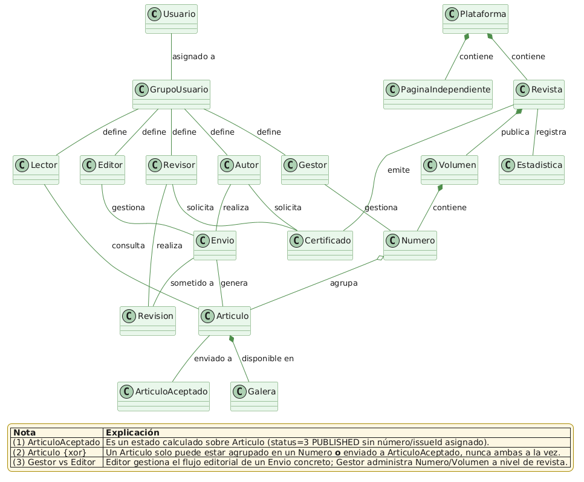

Entidades centrales: `Usuario` → `GrupoUsuario` (Lector, Autor, Revisor, Editor, Gestor), `Revista` → `Volumen` → `Numero` → `Articulo`, `Envio` → `Revision`, `Certificado`. Un `Articulo` es "Aceptado" cuando está publicado (status=3) pero aún no tiene `Numero` asignado — estado calculado, no una tabla propia. Esta distinción de estados es la que hace posible **Consultar Artículos Aceptados**, y la que **Migrar Datos** tiene que reproducir correctamente al convertir el histórico.

## Actores

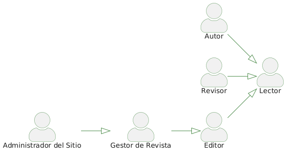

Jerarquía de herencia: **Lector** (base) → **Autor** / **Revisor** → **Editor** → **Gestor de Revista** → **Administrador del Sitio**. Los cuatro casos de uso presentados involucran principalmente a:

- **Administrador del Sitio**: único actor de Migrar Datos y Personalizar Plataforma.
- **Autor / Revisor**: actores de Solicitar Certificado.
- **Lector** (y cualquier visitante, autenticado o no): actor de Consultar Artículos Aceptados.

## Casos de uso presentados

| Caso de uso | Actor | Por qué es relevante |
|---|---|---|
| **Migrar Datos** | Administrador del Sitio | Base técnica del proyecto: usuarios/roles se importan con el módulo nativo de OJS; números y artículos se convierten de estructura con `FastConverter` (3.1 → 3.4.0.1) y se importan también con el módulo nativo, sin perder datos. |
| **Personalizar Plataforma** | Administrador del Sitio | Activa el tema propio y el plugin genérico, y despliega el microservicio de certificados — sin tocar el core de OJS. |
| **Consultar Artículos Aceptados** | Lector / cualquier usuario | Funcionalidad que no existe en una instalación estándar de OJS: muestra artículos ya aprobados pero aún sin número asignado. |
| **Solicitar Certificado** | Autor / Revisor | Genera en PDF un certificado de participación, consultando directamente la base de datos vía el microservicio. |

Diagramas de los módulos a los que pertenecen:

| Módulo | Diagrama |
|---|---|
| Certificado | 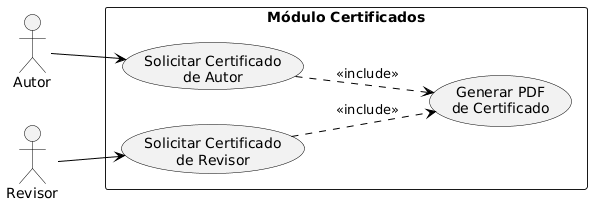 |
| Consulta | 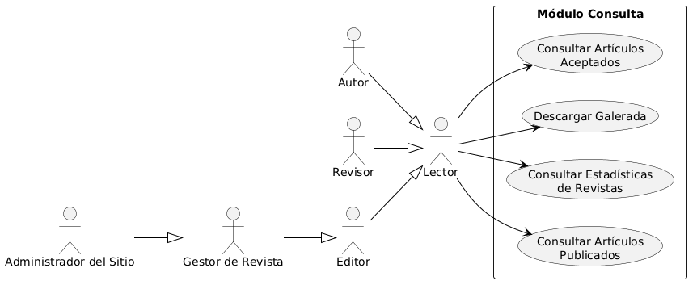 |
| Gestión (Migrar Datos, Personalizar Plataforma) | 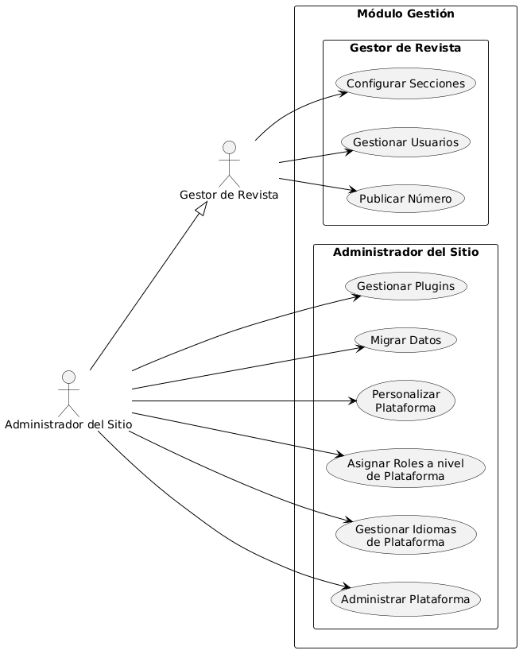 |

## Detalle de los casos de uso

| Caso de uso | Diagrama de actividad | Diagrama de secuencia |
|---|---|---|
| Migrar Datos | 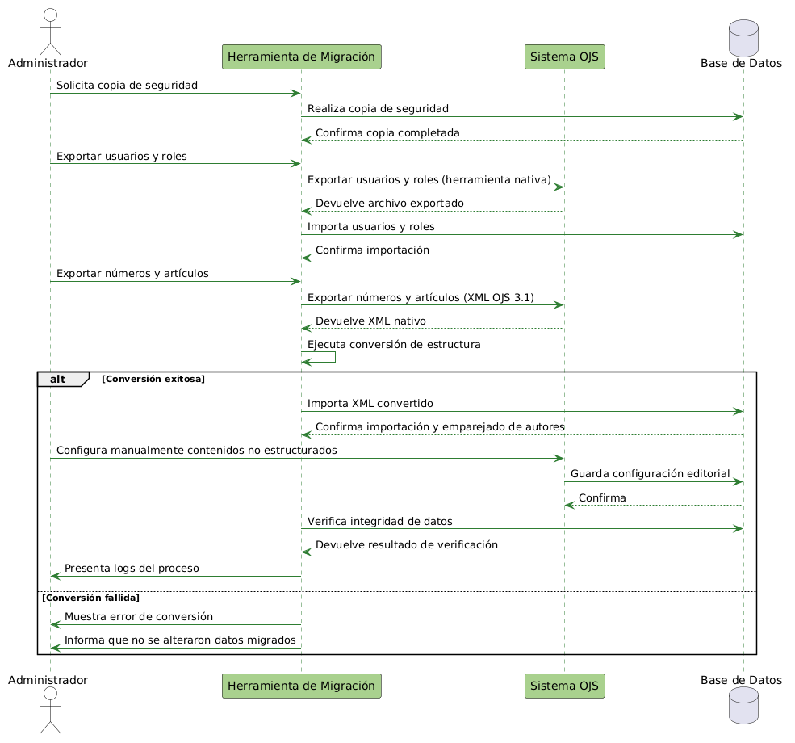 | *(solo existe el fuente PlantUML: [DiagramasDeSecuenciaMigrar.txt](FinalTFG-Actual2026/DiagramasDeSecuenciaMigrar.txt); falta exportarlo a imagen)* |
| Personalizar Plataforma | 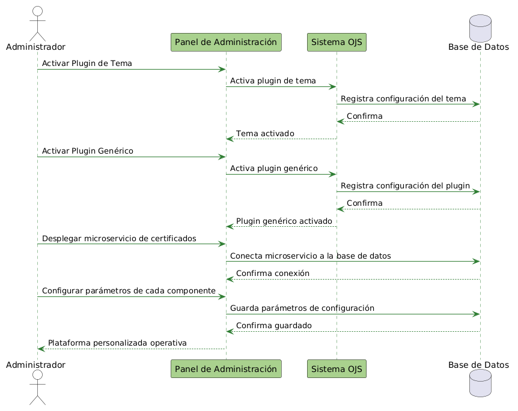 | *(solo existe el fuente PlantUML: [DiagramasDeSecuenciaPersonalizar.txt](FinalTFG-Actual2026/DiagramasDeSecuenciaPersonalizar.txt); falta exportarlo a imagen)* |
| Consultar Artículos Aceptados | 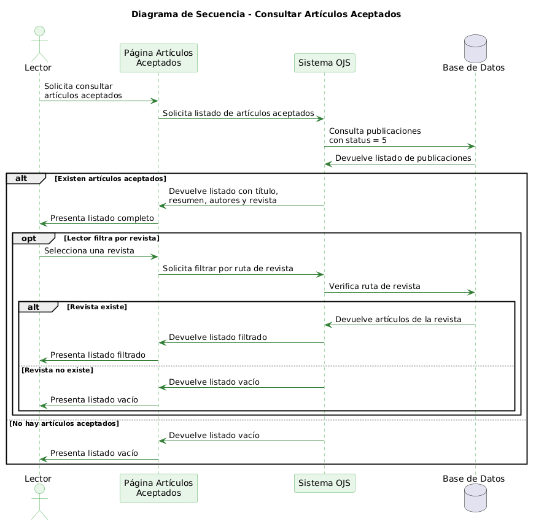 | 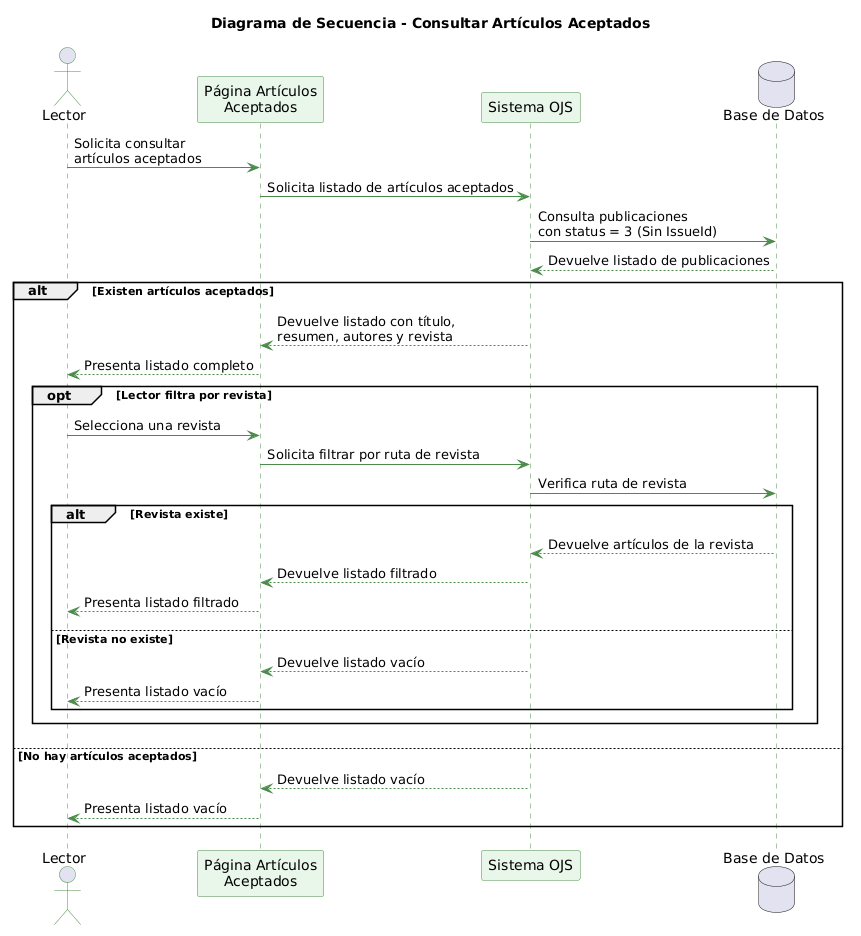 |
| Solicitar Certificado | 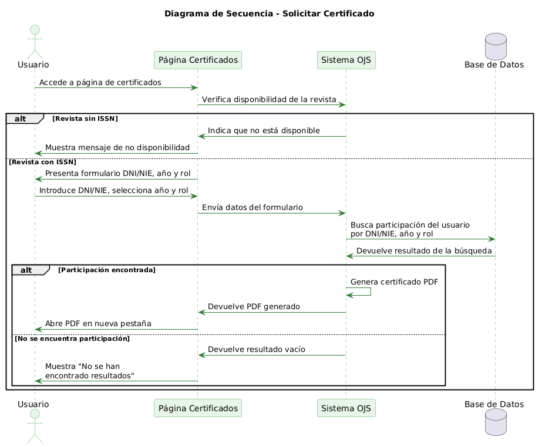 | *(no existe ni siquiera el fuente en el repo; falta crearlo)* |

Análisis de caso de uso (modelo-vista-controlador):

| Caso de uso | Análisis MVC |
|---|---|
| Migrar Datos | 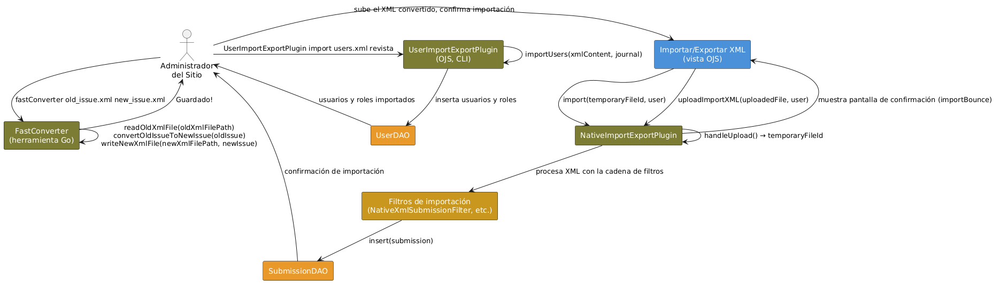 |
| Personalizar Plataforma | 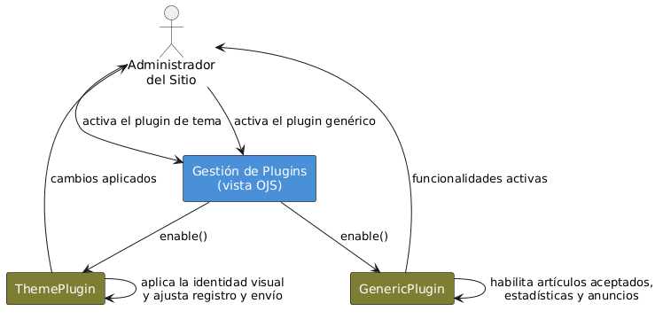 |
| Solicitar Certificado | 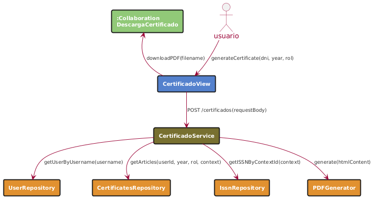 |

## Arquitectura interna: modelos, controladores y vistas

| Capa | Diagrama |
|---|---|
| Modelos | 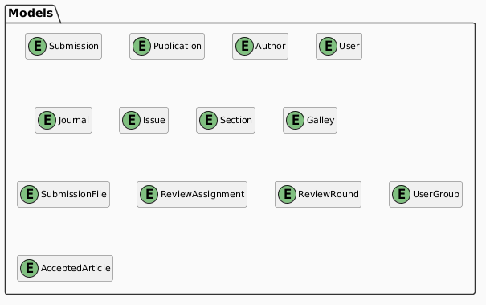 |
| Controladores | 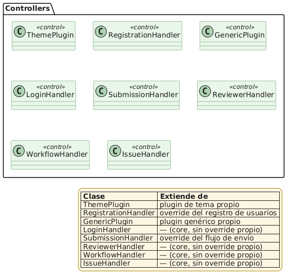 |
| Vistas |  |

Clases relevantes para los 4 casos de uso presentados: `ThemePlugin` y `GenericPlugin` (Personalizar Plataforma), `UserImportExportPlugin` / `NativeImportExportPlugin` / `FastConverter` (Migrar Datos), `CertificadoView` / `CertificadoService` (Solicitar Certificado).

## Prototipos

Migrar Datos y Personalizar Plataforma no requirieron diseño propio: reutilizan los módulos nativos de importación/exportación y configuración del sitio de OJS, por eso se muestran directamente en alta fidelidad. Consultar Artículos Aceptados y Solicitar Certificado sí tuvieron wireframe propio antes de implementarse.

*Pendiente: las imágenes de prototipo aún no aparecen en el repositorio con nombres reconocibles para estos 4 casos de uso. Dime la carpeta/nombres cuando las subas y las enlazo.*

## La plataforma en funcionamiento

*Pendiente: las capturas reales de Migrar Datos, Personalizar Plataforma, Artículos Aceptados y el PDF de Certificado (capítulo 5 del TFG) no aparecen todavía en el repositorio.*

## Arquitectura y stack tecnológico

- **OJS 3.4.0.1** (PHP 8.2, Smarty) — plataforma base, sin modificaciones al core.
- **MariaDB 11.8** — persistencia, red interna Docker `inside`.
- **Docker Compose** — `pkp_app` (Apache 2.4 + PHP 8.2 + OJS + plugins) y `pkp_db` (MariaDB), puertos 8080/8443.
- **Microservicio de certificados** — Node.js, puerto 5000, genera PDF con `wkhtmltopdf`. Componente clave de Solicitar Certificado y de Personalizar Plataforma (se despliega en ese caso de uso).
- **FastConverter** — herramienta en Go que convierte solo la *estructura* del XML de números/artículos de OJS 3.1 al esquema de OJS 3.4.0.1; el import/export real (usuarios, números, artículos ya convertidos) lo hace el módulo nativo de OJS.

Diagrama de despliegue: 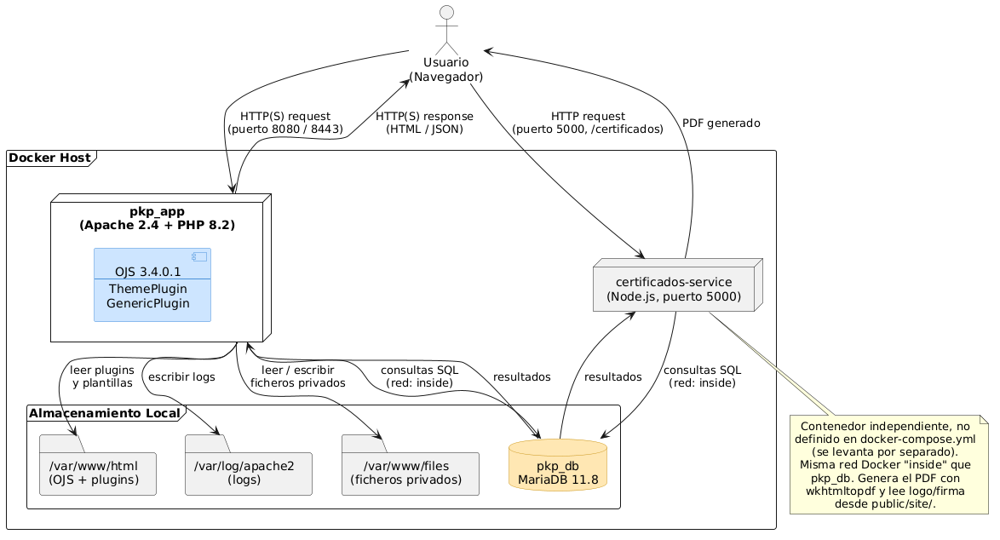

Diagrama entidad-relación: 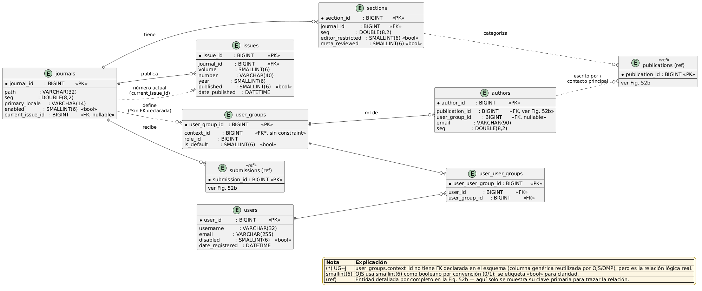 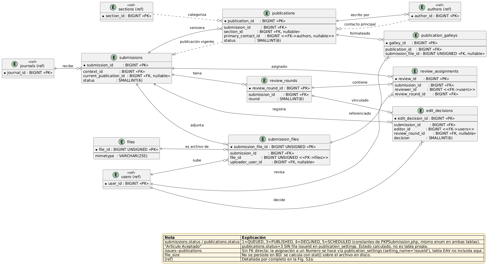
